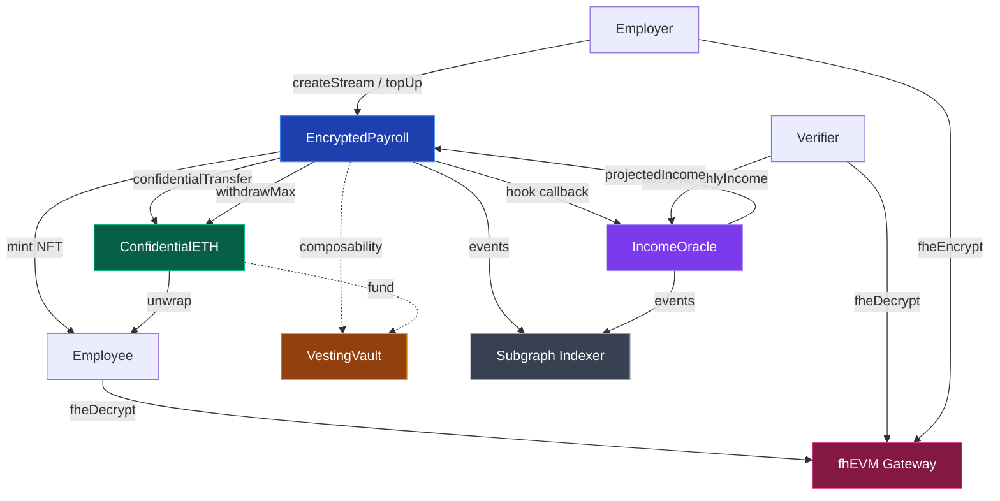
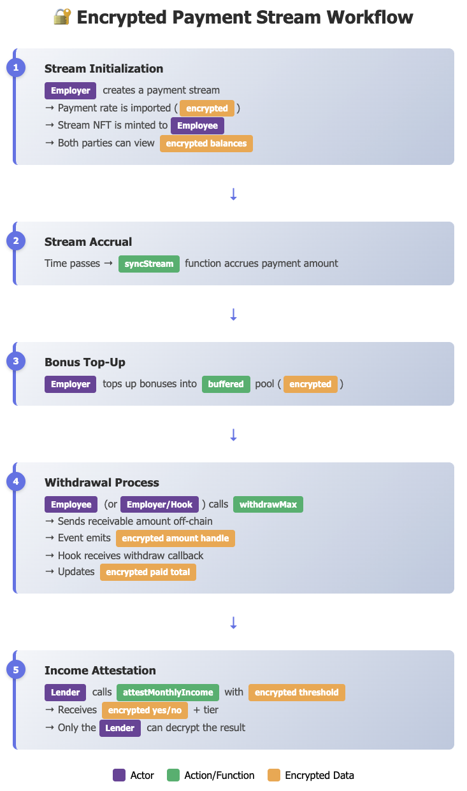

# PayProof

**Privacy-preserving payroll streaming and proof-of-income attestations powered by Zama's fhEVM**

PayProof enables employers to stream encrypted salaries on-chain, employees to decrypt their earnings privately, and third-party verifiers to request income threshold proofs without ever learning the actual salary amounts. Built with fully homomorphic encryption (FHE) using Zama's fhEVM technology.

## 🎥 Demo

> **Live demo**: [Coming soon — pending Sepolia fhEVM coprocessor stability]
>
> Key flows to try:
> 1. `/employer` — Create an encrypted payroll stream
> 2. `/employee` — Decrypt salary and withdraw funds
> 3. `/verify` — Request a privacy-preserving income attestation
> 4. `/vesting` — Explore encrypted vesting schedules

## 🎯 Overview

PayProof solves a critical privacy problem in blockchain-based payroll: how to prove income eligibility (for loans, rentals, etc.) without revealing your exact salary. Traditional blockchain transactions are public, making salary information visible to everyone. PayProof uses fully homomorphic encryption to keep salary data encrypted on-chain while still enabling:

- ✅ Real-time salary streaming with encrypted rates
- ✅ Private balance decryption for authorized parties only
- ✅ Zero-knowledge income threshold verification
- ✅ Tiered attestations (A/B/C) without revealing exact amounts

## 🏗️ Architecture



### Smart Contracts (Solidity + fhEVM)

**EncryptedPayroll.sol** – Confidential lockup & streaming

- **Encrypted state machine:** Streams are represented as structured records containing the encrypted rate, balances, unlock schedules, cliff/transferability flags, hook address, and numeric ID. Lifecycle transitions (Active ↔ Paused, Cancelled → Settled) are enforced at the contract level so downstream apps can rely on consistent status semantics.
- **Homomorphic balance math:** Per-second rates (`euint64`) accumulate into encrypted balances (`euint128`). Top-ups, withdrawals, and accruals all run inside fhEVM, keeping amounts shielded while still allowing deterministic balance queries.
- **Hook-driven composability:** Streams can opt into encrypted callbacks (on withdraw/cancel) for allowlisted contracts such as the IncomeOracle. Hooks receive ciphertext handles, enabling integrations (staking, vaults, credit scoring) without leaking raw values.
- **Access controls & settlement:** Employers control cancelability, transferability, hooks, and top-ups; employees (or authorized hooks) can withdraw. Withdrawals zero out balances without disrupting active streams, while cancelled streams settle once their final withdrawal completes so NFTs can be recycled safely.
- **cETH settlement layer:** Funding and payouts run through a confidential ERC7984 token (`ConfidentialETH`) so every encrypted balance corresponds to real wrapped ETH. Employers wrap ETH→cETH, authorize the payroll contract as an operator, and each withdrawal performs an encrypted token transfer.

**ConfidentialETH.sol** – ERC7984 wrapper for WETH

- **Dual entry points:** Supports both `wrapNative` (direct ETH deposits) and ERC-20 WETH wrapping to mint encrypted balances with fhEVM-friendly 6-decimal precision.
- **Operator aware:** Employers grant PayProof operator rights with expiries, letting `EncryptedPayroll.topUp` pull funding atomically during stream provisioning.
- **Deterministic unwraps:** Employees can unwrap cETH back into WETH (and then ETH) via asynchronous decryption flows once their confidential withdrawals settle.

**ConfidentialVestingVault.sol** – cETH-backed encrypted vesting schedules

- **Allowlisted sponsors:** Admins gate who can create schedules, mirroring HR-approved employers.
- **Private cliffs + unlocks:** Start time, cliff, duration, cancelability, and initial unlock BPS remain public while the amounts and released totals stay encrypted (`euint128`).
- **NFT receipts:** Each schedule mints an ERC-721 token to the beneficiary. Transfers are blocked until the schedule has fully vested (unless revoked) so secondary markets can prove ownership.
- **Cancelable/refundable:** Sponsors can mark schedules as cancelable. When revoked, vested-but-unpaid funds go to the beneficiary, the remainder refunds the sponsor, and both transfers emit new ciphertext handles.
- **fhEVM integration:** Withdrawals, cancellations, and encrypted amount queries emit handles that the `/vesting` React dashboard can decrypt client-side with the fhEVM SDK.

**IncomeOracle.sol** – Threshold attestations with encrypted deltas

- **Hook ingestion:** Implements `IConfidentialLockupRecipient` so the payroll contract pushes encrypted withdraw/cancel events. Paid and outstanding amounts are accumulated homomorphically, keeping a running encrypted ledger per stream.
- **Encrypted comparisons:** Verifiers encrypt thresholds and lookback windows. The oracle combines projected income from `EncryptedPayroll` with accumulated paid totals, evaluates the comparison homomorphically, and emits encrypted meets/tier handles.
- **Tier policy:** Tier C (meets threshold), Tier B (≥1.1×), Tier A (≥2×). Since the tier logic executes on ciphertexts, neither the contract nor verifiers learn the underlying salary.
- **Queryable handles:** Utility getters (`encryptedPaidAmount`, `encryptedOutstandingOnCancel`) let wallets/UI display encrypted balances or request temporary decryption via fhEVM SDKs, keeping the UX responsive while preserving privacy.

### Frontend (Next.js 15 + TypeScript)

**Three-persona architecture:**

- **`/employer`** - Create encrypted streams, view active streams, manage payroll
- **`/employee`** - View encrypted streams, decrypt salary amounts, generate proofs
- **`/verify`** - Submit encrypted thresholds, receive tiered attestations
- **`/vesting`** - Explore cETH vesting schedules, batch-create cliffs, and withdraw after the cliff unlock under encryption

**Tech Stack:**

- Next.js 15 with App Router
- Zama fhEVM Relayer SDK (`@zama-fhe/relayer-sdk`)
- fhEVM TypeScript SDK for React ([`fhevm-ts-sdk`](https://www.npmjs.com/package/fhevm-ts-sdk))
- Wagmi + Viem for wallet connectivity
- ethers.js for contract interactions
- TailwindCSS for styling

### Deployed Contracts (Sepolia)

| Contract | Address |
|----------|---------|
| **ConfidentialETH** | `0x4F33CFb1654c6Ca3007F3216A1e00EbFEfB0e6E4` |
| **EncryptedPayroll** | `0x9602144440f7299Ba20D3828760566B11f47a448` |
| **IncomeOracle** | `0xb060fa9DfE78f07b898d7a3488e0D4229a2edfA6` |
| **ConfidentialVestingVault** | `0x56C6327cd02BB204dCCC062caEFDb9de49b43297` |
| **ConfidentialTokenFactory** | `0xe27981Fc6210959fe463424859aA13DEaC6B5A24` |

### Stream NFTs & Indexing

- Each payroll stream now mints a transferable (unless explicitly disabled) ERC-721 token to the employee. Wallets can enumerate active and historical streams with standard NFT calls (`balanceOf`, `tokenOfOwnerByIndex`).
- For sender views and analytics, use the Graph subgraph in `subgraph/`. Configure the endpoint via `NEXT_PUBLIC_PAYPROOF_SUBGRAPH_URL` and follow the deployment steps in `subgraph/README.md`.

## Deploying the Subgraph (Sepolia)

PayProof ships a ready‑to‑deploy subgraph under `subgraph/`. These steps compile the mappings and push them to **Graph Studio** under the slug `pay-proof` (as shown in the screenshot above). Adjust the slug/version if you fork the project.

1. **Prerequisites**

   - Install pnpm (`npm i -g pnpm`) and the Graph CLI (`pnpm add -g @graphprotocol/graph-cli`).
   - Ensure the PayProof contracts have been compiled so the ABI in `subgraph/abis/EncryptedPayroll.json` is up to date:
     ```bash
     pnpm --filter @payproof/contracts build
     ```
2. **Install subgraph tooling & generate types**

   ```bash
   pnpm --filter @payproof/subgraph install
   pnpm --filter @payproof/subgraph run codegen
   pnpm --filter @payproof/subgraph run build
   ```

   After the build you should see `subgraph/build/subgraph.yaml` and `EncryptedPayroll/EncryptedPayroll.wasm`.
3. **Deploy to Graph Studio**

   - In the Graph Studio UI create (or reuse) the slug `pay-proof` and copy the deploy key (e.g. `091d92f42ef1470dad9f7b793b97de26`).
   - Deploy from the repo root:

     ```bash
     graph deploy \
       --node https://api.studio.thegraph.com/deploy/ \
       --access-token <DEPLOY_KEY> \
       --version-label v0.1.1 \
       pay-proof subgraph/subgraph.yaml
     ```

     Notes:- `--access-token` is the flag currently accepted by Studio (the CLI warns it will switch to `--deploy-key` in the future).

     - `--version-label` controls the published version (`v0.1.1`, `v0.2.0`, etc.).
4. **Configure the frontend**

   - Graph Studio returns the query endpoint in the deploy output, e.g.:
     ```
     https://api.studio.thegraph.com/query/1704881/pay-proof/v0.1.1
     ```
   - Add this to `apps/web/.env`:
     ```bash
     NEXT_PUBLIC_PAYPROOF_SUBGRAPH_URL="https://api.studio.thegraph.com/query/1704881/pay-proof/v0.1.1"
     ```
   - Rebuild/redeploy the web app so employers load stream lists via the subgraph.
5. **Subsequent updates**

   - Bump the version label and rerun the same `graph deploy` command after editing mappings or schema.
   - If you redeploy contracts to a new network update `subgraph/subgraph.yaml` (`source.address`, `network`, `startBlock`) before compiling.

## 🚀 Getting Started

### Prerequisites

- Node.js 20+
- pnpm (recommended) or npm
- MetaMask or compatible Web3 wallet
- Sepolia testnet ETH

### Installation

```bash
# Clone the repository
git clone <repository-url>
cd PayProof

# Install dependencies
pnpm install

# Set up environment variables
cp apps/web/.env.example apps/web/.env
cp contracts/.env.example contracts/.env

# Configure your .env files with:
# - NEXT_PUBLIC_SEPOLIA_RPC_URL
# - NEXT_PUBLIC_PAYPROOF_PAYROLL_CONTRACT=0x9602144440f7299Ba20D3828760566B11f47a448
# - NEXT_PUBLIC_PAYPROOF_ORACLE_CONTRACT=0xb060fa9DfE78f07b898d7a3488e0D4229a2edfA6
# - NEXT_PUBLIC_PAYPROOF_CONFIDENTIAL_TOKEN=0x4F33CFb1654c6Ca3007F3216A1e00EbFEfB0e6E4
# - NEXT_PUBLIC_PAYPROOF_VESTING_CONTRACT=0x56C6327cd02BB204dCCC062caEFDb9de49b43297
# - NEXT_PUBLIC_PAYPROOF_SUBGRAPH_URL=https://api.studio.thegraph.com/query/1704881/pay-proof/v0.1.1
```

### Running Locally

```bash
# Start development server
pnpm dev

# Access at http://localhost:3000
```

### Testing

```bash
# Run contract unit tests
pnpm contracts:compile
pnpm test:contracts

# Run end-to-end tests (Playwright)
pnpm test:e2e
```

### Useful commands

From the repo root:

- `pnpm contracts:compile` – compile all Solidity sources in `contracts/`
- `pnpm contracts:clean` – clear Hardhat artifacts/cache
- `pnpm --filter @payproof/contracts exec -- hardhat run scripts/deployPayroll.ts --network sepolia` – deploy the latest `EncryptedPayroll`
- `pnpm --filter @payproof/contracts exec -- hardhat run scripts/deployOracle.ts --network sepolia` – (re)deploy the oracle if needed
- `pnpm --filter @payproof/contracts exec -- hardhat run scripts/deployConfidentialEth.ts --network sepolia` – deploy the cETH wrapper (requires `UNDERLYING_WETH_ADDRESS` in `contracts/.env`)
- `pnpm --filter @payproof/contracts exec -- hardhat run scripts/deployVestingVault.ts --network sepolia` – deploy `ConfidentialVestingVault` pointing at the confidential token in `.env`
- `pnpm --filter @payproof/contracts exec -- hardhat verify --network sepolia <CONTRACT_ADDRESS>` – submit verification to Etherscan (may require rerunning under Node 20 to avoid bytecode mismatches)

Before deploying or verifying, populate `contracts/.env` with `SEPOLIA_RPC_URL`, `DEPLOYER_KEY`, `ETHERSCAN_API_KEY`, `UNDERLYING_WETH_ADDRESS`, and `CONFIDENTIAL_TOKEN_ADDRESS` (used when wiring `EncryptedPayroll`).

## 📖 User Flows

### 👔 Employer: Create Encrypted Stream

1. Connect wallet to Sepolia testnet
2. Navigate to `/employer`
3. Enter employee wallet address
4. Set stream rate (ETH per month)
5. Choose cadence (Monthly, Bi-weekly, Weekly)
6. Click "Encrypt & Create Stream"
7. Rate is encrypted client-side with fhEVM
8. Transaction creates on-chain stream with encrypted rate
9. Top up by wrapping ETH → cETH (UI prompts you) so the payroll contract can pull fully encrypted funding
10. View created streams in dashboard

### 👤 Employee: View & Decrypt Salary

1. Connect wallet to Sepolia testnet
2. Navigate to `/employee`
3. See list of active encrypted streams
4. Click on a stream to view details
5. Click "🔓 Decrypt Amount"
6. Sign EIP-712 message to authorize decryption
7. View decrypted salary rate (ETH/month)
8. Only you and employer can decrypt this amount; confidential withdrawals arrive as cETH which you can unwrap back to ETH at any time

### 🔍 Verifier: Request Income Proof

1. Connect wallet to Sepolia testnet
2. Navigate to `/verify`
3. Enter employer wallet address
4. Set income threshold (ETH per month)
5. Set lookback window (days)
6. Click "Encrypt & Request Proof"
7. Threshold is encrypted client-side
8. Oracle performs encrypted computation
9. Receive encrypted attestation (meets + tier)
10. Click "🔓 Decrypt Result"
11. See threshold met status and tier (A/B/C)
12. Never learn the exact salary amount

### ⛰️ Vesting Vault: Employers & Beneficiaries

1. Navigate to `/vesting` to see the encrypted vesting hero + dashboard.
2. Employers connect wallets, wrap ETH → cETH, and encrypt lump-sum grants with fhEVM.
3. Enter beneficiary, duration, cliff, and initial unlock BPS; submit to `ConfidentialVestingVault`.
4. Use the batch creator to encrypt CSV rows or export a Safe Transaction Builder JSON for multi-sig review.
5. Beneficiaries fetch schedules by ID, view sponsor/beneficiary metadata, and decrypt ciphertext handles locally.
6. Once the cliff timestamp has passed they can withdraw to any address, receiving freshly encrypted payout handles on every settlement.

### Privacy Guarantees

- Verifiers learn: ✅ Threshold met (yes/no) + Tier (A/B/C/None)
- Verifiers NEVER learn: ❌ Exact salary amount
- On-chain data: Only encrypted ciphertexts (handles)
- Decryption: Requires private key signature (employer/employee only)

### Sequence Overview

```
Employer        FHE SDK        EncryptedPayroll       Employee      Hook / Oracle         Lender
    |             |                   |                  |                |                 |
    | encrypt rate|                   |                  |                |                 |
    |-----------> |                   |                  |                |                 |
    |<--enc. rate-|                   |                  |                |                 |
    | createStream(encRate, proof) --------------------->|                |                 |
    |             |                   |--mint NFT------->|                |                 |
    |             |                   |--emit StreamCreated (enc handles)->|                |
    |             |                   |                  |                |                 |
    |<=========== Both parties decrypt balances with fhEVM SDK ===========>|                 |
    |             |        (time)      |                  |                |                 |
    |             |------------------->| syncStream accrues encrypted "accrued"             |
    |             |                   |                  |                |                 |
    | topUp(encBonus, proof) --------------------------------------------->|                 |
    |             |                   |--buffered += encBonus-------------|                 |
    |             |                   |--emit StreamToppedUp-------------->|                 |
    |             |                   |                  |                |                 |
    | withdrawMax(streamKey, to) ------------------------>|                |                 |
    |             |                   |--emit StreamWithdrawn (enc amount)->|               |
    |             |                   |--notify onConfidentialLockupWithdraw--------------->|
    |             |                   |                  |                |--update paid----|
    |             |                   |                  |                |                 |
    |             |                   |                  |                |                 |
    |             |                   |                  |                |                 |
    |             |                   |                  |                |                 |
    |             |<------- encrypt threshold -----------|                |                 |
    |             |                   |<--attestMonthlyIncome(encThreshold, proof, days)---|
    |             |                   |--projectedIncome + compare (all FHE)               |
    |             |                   |--return enc meetsFlag + tier -->|                  |
    |             |                   |                  |                |                 |
    |             |                   |                  |                |<--decrypt result|
```

### Workflow Summary



1. **Stream Initialization** – Employer encrypts the salary rate, calls `createStream`, the contract mints the stream NFT to the employee, and both parties receive encrypted balance handles.
2. **Stream Accrual** – `syncStream` multiplies the encrypted rate by elapsed time to grow the encrypted accrued balance.
3. **Bonus Top-Up** – Employer encrypts a bonus amount and calls `topUp`, adding the ciphertext to the encrypted buffered pool.
4. **Withdrawal Process** – Employee, employer, or hook invokes `withdrawMax`. The contract emits a fresh encrypted amount handle and any registered hook (e.g., IncomeOracle) updates paid totals through the callback.
5. **Income Attestation** – A lender encrypts a threshold and calls `attestMonthlyIncome`. The oracle compares projected income vs. threshold completely under encryption and returns encrypted yes/no + tier results that only the lender can decrypt.

## 🧪 Test Coverage

### Contract Tests

**EncryptedPayroll.sol** (35+ tests)

- Stream creation and lifecycle
- Balance accrual over time
- Top-up functionality
- Pause/resume operations
- Balance tracking and queries
- Stream cancellation
- Encrypted balance handle refresh after sync
- Edge cases (small/large rates, multiple streams)

**IncomeOracle.sol** (30 tests)

- Basic attestation flow
- Tier calculations (A/B/C/None)
- Lookback window variations (7/30/60/90 days)
- Edge cases and boundary conditions
- Multiple streams and attestations
- Privacy guarantees
- Integration with payroll contract
- Gas optimization

### Web Tests (14 Playwright tests)

- Employer flow: wallet connection, stream creation, encryption preview
- Employee flow: stream list, decryption, proof generation
- Stream detail view: wallet gating for decrypt actions
- Verifier flow: attestation form, threshold encryption, tier decryption

**Note**: Wallet-connected paths are planned once fhEVM/wagmi mocking is in place

## 🔐 Security Considerations

### Access Control Model

| Action | Employer | Employee | Hook | Admin | Verifier |
|--------|----------|----------|------|-------|----------|
| createStream | ✅ | | | | |
| topUp | ✅ | | | | |
| pauseStream | ✅ | | | | |
| resumeStream | ✅ | | | | |
| cancelStream | ✅ | | | | |
| withdrawMax | ✅ (to employee only) | ✅ (to any) | ✅ (to employee only) | | |
| configureStream | ✅ | | | | |
| setStreamHook | ✅ | | | | |
| allowHook | | | | ✅ | |
| attestMonthlyIncome | | | | | ✅ |

### FHE Permission Model

- **Stream rate**: readable by employer + employee + contract
- **Balance handles**: readable by employer + employee + hook (if set)
- **Attestation results**: readable by verifier (msg.sender)
- All ciphertexts stored as handles on-chain; decryption requires EIP-712 signature

### Hook Allowlist Mechanism

- Admin maintains a whitelist of approved hook contracts
- Employers can only register allowlisted hooks per stream
- Hooks receive encrypted handles on withdraw/cancel callbacks
- ReentrancyGuard protects against callback-based attacks

## ⛽ Gas Estimates

| Operation | Approximate Gas | Notes |
|-----------|----------------|-------|
| createStream | ~350,000 | Includes FHE proof validation + NFT mint |
| topUp | ~200,000 | FHE encrypted transfer |
| syncStream | ~150,000 | FHE multiply + add |
| withdrawMax | ~250,000 | FHE compute + confidential transfer |
| cancelStream | ~180,000 | Plus hook callback if configured |
| attestMonthlyIncome | ~400,000 | FHE comparisons + tier computation |
| batchCreateStreams (5) | ~1,500,000 | ~300K per stream |

> **Note**: Gas costs are approximate and vary with fhEVM coprocessor state. FHE operations are significantly more expensive than plaintext equivalents.

## ⚠️ Known Limitations

- **Async decryption latency**: On Sepolia testnet, fhEVM Gateway decryption takes 15-30 seconds. Production networks will have lower latency.
- **E2E wallet tests**: Browser-based tests with real wallet signatures are pending fhEVM mocking infrastructure in Playwright.
- **FHE computation overhead**: Encrypted arithmetic costs ~10-50x more gas than plaintext equivalents. Batch operations amortize this.
- **Stream key uniqueness**: One active stream per employer-employee pair. Use different addresses for multiple concurrent streams.

## 📐 Decryption Math

When the frontend calls `instance.userDecrypt` it submits up to four handles bound to the payroll contract address:

| Handle                                          | Symbol | Meaning                           | Decrypted Value |
| ----------------------------------------------- | ------ | --------------------------------- | --------------- |
| `stream.rateHandle`                           | `r`  | Encrypted rate per second         | `r` (wei/s)   |
| `stream.bufferedHandle`                       | `B`  | Accrued but still buffered amount | `B` (wei)     |
| `stream.withdrawnHandle`                      | `W`  | Total withdrawn so far            | `W` (wei)     |
| `balanceHandle` (from `encryptedBalanceOf`) | `A`  | Withdrawable balance              | `A` (wei)     |

The fhEVM contracts guarantee the invariant `A = (S + B) − W`, where `S` represents the encrypted accrual that is neither buffered nor withdrawn. Rearranging gives the core identity the UI uses after decryption:

```
streamed = A + W − B
```

With these cleartext numbers the app derives all user-facing values:

- Monthly rate: `rate_per_month = r × 30 × 24 × 60 × 60`
- Streamed total: `streamed = A + W − B` (fallback `max(W − B, 0)` if `A` is missing)
- Buffered balance: `buffered = B`
- Withdrawn total: `withdrawn = W`
- Available to withdraw: `available = A`
- Outstanding debt: `debt = max(W − streamed − B, 0)`

The handle array therefore fully determines the visible payroll metrics once decrypted, while the ciphertexts remain private on-chain.

## 🛠️ Technology Stack

### Blockchain

- **Solidity 0.8.24** - Smart contract language
- **fhEVM** - Fully homomorphic encryption for Ethereum
- **Hardhat** - Development environment
- **@fhevm/hardhat-plugin** - fhEVM testing and mocking
- **Sepolia Testnet** - Deployment network

### Frontend

- **Next.js 15** - React framework with App Router
- **React 19** - Latest React with enhanced features
- **TypeScript** - Type safety
- **Wagmi** - React hooks for Ethereum
- **Viem** - TypeScript Ethereum library
- **Zama Relayer SDK** - Client-side FHE encryption/decryption
- **ethers.js** - Ethereum wallet implementation
- **TailwindCSS** - Styling

### Testing

- **Hardhat Test** - Solidity unit tests
- **Playwright** - End-to-end testing
- **Chai** - Assertion library

## 🗺️ Roadmap

### ✅ Phase 1: Core Functionality (Completed)

- [X] Encrypted payroll stream creation
- [X] Real-time balance accrual
- [X] Client-side encryption/decryption
- [X] Pause and resume streams
- [X] Privacy-preserving attestations
- [X] Tiered income verification
- [X] Comprehensive test coverage (63+ tests)
- [X] Sepolia deployment

### 🚧 Phase 2: Enhanced Features

- [X] **Employee withdrawal functionality**

  - Encrypted withdrawal flow (continuous accrual + encrypted hooks)
  - UI actions for withdraw & balance handle retrieval
  - `StreamWithdrawn` event mirroring encrypted amount
- [X] **Stream top-up UI**

  - Employer-side encrypted top-up tooling
  - Frontend controls for fhEVM encryption + submission
  - Stream detail page surfaces balance handles after top-up
- [X] **Batch operations**

  - Create multiple streams in one transaction
  - Bulk pause/resume streams
  - Batch top-ups across multiple employees
- [X] **Confidential ETH wrapper**

  - Deploy `ConfidentialFungibleTokenERC20Wrapper` around ETH
  - Support confidential employer funding and withdrawals
  - Reuse wrapped balances for cross-contract private transfers
- [X] **Multi-token support**

  - ConfidentialUSDC wrapper alongside ConfidentialETH
  - ConfidentialTokenFactory for deploying new wrappers
  - Token selection in stream creation and vesting flows
- [ ] **Stream templates**

  - Save commonly used stream configurations
  - Quick-create streams from templates
  - Department-based default rates

### 🔮 Phase 3: Advanced Privacy Features

- [ ] **Multi-stream aggregation**

  - Prove combined income from multiple employers
  - Encrypted sum of all active streams
  - Cross-employer attestations
- [ ] **Time-based proofs**

  - Prove income stability over time periods
  - Historical attestation archives
  - Trend analysis without revealing amounts
- [ ] **Conditional payouts**

  - Milestone-based encrypted releases
  - Performance-linked encrypted bonuses
  - Scheduled rate adjustments
- [ ] **Privacy-preserving analytics**

  - Encrypted aggregate statistics
  - Department-wide metrics without individual exposure
  - Compliance reporting with FHE

### 🌐 Phase 4: Ecosystem Integration

- [ ] **DeFi integrations**

  - Use income attestations for undercollateralized loans
  - Yield farming with income-based tiers
  - Insurance products based on verified income
- [ ] **Multi-chain support**

  - Deploy to Ethereum mainnet with fhEVM
  - Cross-chain attestation verification
  - Bridge encrypted streams across chains
- [ ] **Verifier marketplace**

  - Decentralized verifier registry
  - Reputation system for attestation quality
  - Automated verification for common use cases (mortgages, rentals)
- [ ] **Mobile app**

  - React Native mobile wallet
  - Push notifications for stream events
  - Biometric decryption authorization

### 🔧 Phase 5: Developer Experience (Ongoing)

- [ ] **SDK and tooling**

  - JavaScript/TypeScript SDK for integration
  - CLI tools for stream management
  - Webhook notifications for events
- [ ] **Documentation**

  - Interactive tutorials
  - Integration guides
  - Video walkthroughs
- [ ] **Testing improvements**

  - E2E tests with wallet mocking
  - fhEVM integration test environment
  - Performance benchmarking suite

### 💡 Future Research

- Zero-knowledge proof integration for additional privacy layers
- Homomorphic encryption optimizations for gas reduction
- Privacy-preserving payroll tax calculations

## 📄 License

MIT License - See LICENSE file for details

## 🙏 Acknowledgments

Built with [Zama&#39;s fhEVM](https://www.zama.ai/fhevm) - Fully Homomorphic Encryption for Ethereum

Submitted for the Zama Special Bounty Track — Confidential Payroll by coderlu

---

**Disclaimer**: This is experimental software. Do not use in production without thorough security audits.
